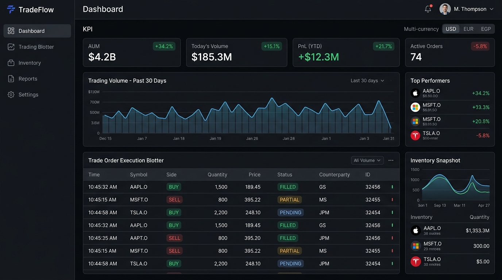
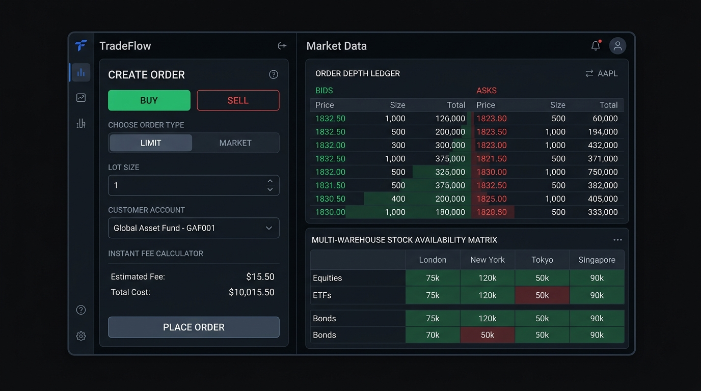
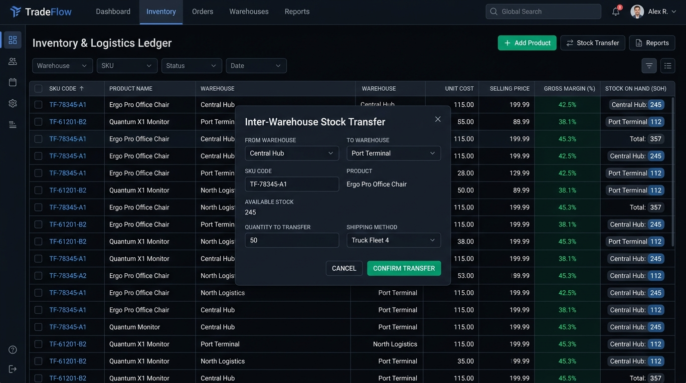

# TradeFlow ERP — Institutional Trading & Logistics Platform

> A modern, multi-tenant enterprise resource planning (ERP) platform and execution system for trading, distribution, and commodity firms. Featuring real-time order routing, multi-location inventory ledgers, counterparty credit risk control, and tax-compliant billing.

---

## 📸 Platform Screenshots

### 1. Executive Dashboard & Telemetry
High-density overview monitoring operational KPIs, volume trends, order execution streams, and low-inventory alerts.



### 2. Trading Execution Terminal
Institutional order ticket for quick booking, live multi-warehouse stock availability matrix, and real-time fee calculation.



### 3. Multi-Warehouse Asset Inventory & Logistics
SKU registry, inter-warehouse transfers, inbound goods receiving, and gross margin tracking across distribution centers.



---

## 🌟 Core Features

### ⚡ Trading & Execution Terminal
- **Instant Order Booking**: Book spot and forward sales orders with lot sizing, unit price customization, and auto-populated client accounts.
- **Multi-Warehouse Allocation Matrix**: Real-time visibility into stock availability across facilities before routing an order.
- **Dynamic Fee & Tax Derivation**: Real-time computation of subtotals, VAT, platform transaction fees, and net settlement totals.

### 📦 Multi-Warehouse Asset Inventory
- **Real-Time Stock Isolation**: Separate on-hand, reserved, and available stock levels per product and warehouse.
- **Inter-Warehouse Stock Transfers**: Rebalance inventory between regional hubs and port terminals with transaction logs.
- **Inbound Goods Receiving**: Record inbound shipments with quantity receipts and landed cost tracking.
- **Live Price & Margin Management**: Direct inline selling price adjustments and gross margin percentage calculations.
- **Excel & CSV Export**: Instant export of inventory valuation and stock levels for accounting audits.

### 📋 Order Management Blotter
- **Full Lifecycle Pipeline**: Transition orders seamlessly across `Draft` → `Confirmed` → `Completed` → `Cancelled`.
- **Automated Stock Reservations**: Reserving stock on confirmation and committing decrements upon fulfillment.
- **Barcode & SKU Lookup**: Rapid item addition to orders via SKU and barcode input.

### 🧾 Invoicing & Payment Settlement
- **Automated Tax Invoicing**: Generates sequential tax invoices upon sales order execution.
- **Voucher Layouts**: Built-in support for formal **A4 invoices** and **80mm POS thermal receipts**.
- **Payment Collection Ledger**: Record partial and full payments with live remaining balance tracking.

### 👥 Counterparties & Credit Risk Control
- **Institutional Client Directory**: Manage commercial accounts, contact profiles, and enterprise details.
- **Revolving Credit Facilities**: Enforce maximum credit limits during checkout to mitigate counterparty default risk.
- **Exposure Monitoring**: Visual credit utilization progress bars and risk flags for past-due balances.

### 🌐 Global Infrastructure & Localization
- **Multi-Currency Converter**: On-the-fly currency toggle supporting USD ($), EUR (€), EGP (ج.م), SAR (ر.س), and AED (د.إ).
- **Bilingual Interface**: Native support for **English (LTR)** and **Arabic (RTL)** with layout mirroring.
- **Obsidian Platinum Theme**: High-contrast, dark-mode institutional financial UI designed for prolonged operational use.

---

## 🏛️ System Architecture

TradeFlow is architected as a clean, decoupled full-stack platform:

```
┌─────────────────────────────────────────────────────────────────┐
│                     Client Browser (React SPA)                  │
│   Obsidian Platinum UI · Tailwind CSS · React Context State     │
└───────────────────────────────┬─────────────────────────────────┘
                                │ JSON / REST (Axios + Interceptors)
                                ▼
┌─────────────────────────────────────────────────────────────────┐
│              Backend Service & Gateway (Express / Node.js)       │
│   Authentication · Validation · Business Rules · CORS · Logging │
└───────────────────────────────┬─────────────────────────────────┘
                                │ In-Memory / Relational Storage
                                ▼
┌─────────────────────────────────────────────────────────────────┐
│                  TradeFlow Enterprise Data Layer                │
│   Tenants · Warehouses · Products · Orders · Invoices · Ledger  │
└─────────────────────────────────────────────────────────────────┘
```

### 1. Frontend Architecture
- **Framework**: React 19 + TypeScript bundled with Vite.
- **Design System**: *Obsidian Platinum* design tokens utilizing dark canvas surfaces (`#0B0C0E`, `#15171A`), hairline borders (`#26292E`), and status accents (`#10B981` / `#4EDEA3` for profit, `#F43F5E` for loss, `#F59E0B` for warnings).
- **State Management**: Reactive `TenantContext` providing unified access to products, warehouses, orders, invoices, counterparties, multi-currency conversions, and live notifications.

### 2. Backend API Architecture
- **Framework**: Express.js with TypeScript (`server.ts`).
- **Middleware Pipeline**:
  - Request logging and CORS headers.
  - JWT Bearer authentication verification.
  - Standard RFC 7807 `ProblemDetails` error formatting.
  - Vite SPA middleware mounting in development mode.

---

## 🔌 API Reference & Endpoints

| Category | Endpoint | Method | Description |
|---|---|---|---|
| **Auth** | `/api/auth/login` | `POST` | Authenticate trader and issue JWT access token |
| | `/api/auth/register` | `POST` | Register a new tenant prime account |
| **Products** | `/api/products` | `GET` | List all inventory products and SKU records |
| | `/api/products` | `POST` | Create a new product with opening stock |
| | `/api/products/:id` | `GET` | Retrieve product details |
| | `/api/products/:id` | `DELETE` | Remove a product from the catalog |
| | `/api/products/:id/price` | `PUT` | Update product unit selling price |
| **Warehouses** | `/api/warehouses` | `GET` | List all storage facilities and distribution hubs |
| | `/api/warehouses` | `POST` | Register a new warehouse facility |
| **Stock Logistics** | `/api/warehouses/:id/stock` | `GET` | Get stock level breakdown for a warehouse |
| | `/api/warehouses/:id/stock/receive` | `POST` | Receive inbound stock shipment |
| | `/api/warehouses/:id/stock/transfer` | `POST` | Transfer stock between warehouses |
| **Sales Orders** | `/api/sales-orders` | `GET` | List all sales orders |
| | `/api/sales-orders` | `POST` | Create a new sales order ticket |
| | `/api/sales-orders/:id` | `GET` | Get order details and itemized lines |
| | `/api/sales-orders/:id/status` | `PUT` | Update order status (`مؤكد`, `مكتمل`, etc.) |
| **Invoices** | `/api/invoices` | `GET` | List billing invoices and receivables |
| | `/api/invoices/:id` | `GET` | Get invoice breakdown |
| | `/api/invoices/:id/payments` | `POST` | Register payment receipt against an invoice |
| **Counterparties** | `/api/customers` | `GET` | List customer directory and balances |
| | `/api/customers` | `POST` | Create customer profile |
| | `/api/customers/:id` | `PUT` | Update customer profile |
| | `/api/customers/:id/credit-limit` | `PUT` | Adjust approved credit limit |
| | `/api/customers/:id/status` | `PUT` | Toggle customer active/inactive status |
| **Settings** | `/api/settings` | `GET` | Retrieve tenant configuration parameters |
| | `/api/settings` | `PUT` | Update VAT rates, credit sales, and print layout |

---

## 🗄️ Database Schema & Invariants

```
┌──────────────────┐           ┌──────────────────┐
│    Warehouse     │           │     Customer     │
├──────────────────┤           ├──────────────────┤
│ id (PK)          │           │ id (PK)          │
│ name             │           │ name             │
│ location         │           │ creditLimit      │
│ capacityUsedPct  │           │ outstandingBal   │
└────────┬─────────┘           └────────┬─────────┘
         │ 1                            │ 1
         │                              │
         │ *                            │ *
┌────────┴─────────┐           ┌────────┴─────────┐
│    StockItem     │           │    SalesOrder    │
├──────────────────┤           ├──────────────────┤
│ id (PK)          │           │ id (PK)          │
│ warehouseId (FK) │           │ customerId (FK)  │
│ productId (FK)   │◄────┐     │ warehouseId (FK) │
│ quantityOnHand   │     │     │ status           │
│ quantityReserved │     │     │ totalAmount      │
└──────────────────┘     │     └────────┬─────────┘
                         │              │ 1
                         │ *            │
┌──────────────────┐     │              │ *
│     Product      │─────┘     ┌────────┴─────────┐
├──────────────────┤           │    OrderItem     │
│ id (PK)          │           ├──────────────────┤
│ sku (Unique)     │           │ id (PK)          │
│ name             │           │ orderId (FK)     │
│ unitPrice        │           │ productId (FK)   │
│ costPrice        │           │ quantity         │
│ currentStock     │           │ unitPrice        │
└──────────────────┘           └──────────────────┘
                                        │ 1
                                        │
                                        │ 1
                               ┌────────┴─────────┐
                               │     Invoice      │
                               ├──────────────────┤
                               │ id (PK)          │
                               │ orderId (FK)     │
                               │ totalAmount      │
                               │ paidAmount       │
                               │ balanceDue       │
                               │ status           │
                               └──────────────────┘
```

### Business Rules & Invariants
1. **Stock Availability Invariant**: `Available Stock = OnHand - Reserved`. Orders cannot confirm quantities greater than currently available stock.
2. **Credit Limit Enforcement**: If credit sales are enabled, a customer's `Outstanding Balance + Order Total` must not exceed their `Credit Limit`.
3. **VAT Derivation**: When `TaxEnabled` is true, gross totals calculate the applicable value-added tax and net subtotal using the configured tenant rate.
4. **Automatic Invoice Generation**: Confirming an order automatically provisions a corresponding `Invoice` linked to the order ID.

---

## 🚀 Getting Started

### Prerequisites
- **Node.js** (v18 or higher)
- **npm** or **bun**

### 1. Installation
Clone the repository and install the dependencies:
```bash
git clone https://github.com/Ashraf676-khaled/TradeFlow.git
cd TradeFlow
npm install
```

### 2. Development Mode
Run the development server with live reload:
```bash
npm run dev
```
The application will be accessible at `http://localhost:3000`.

### 3. Production Build
Compile TypeScript and bundle frontend assets:
```bash
npm run build
npm start
```

### 4. Default Credentials
Use the pre-configured credentials to sign in:
- **Email**: `admin@tradeflow.io`
- **Password**: `Password123!`

---

## 🛡️ License
Distributed under the MIT License. See `LICENSE` for more information.
