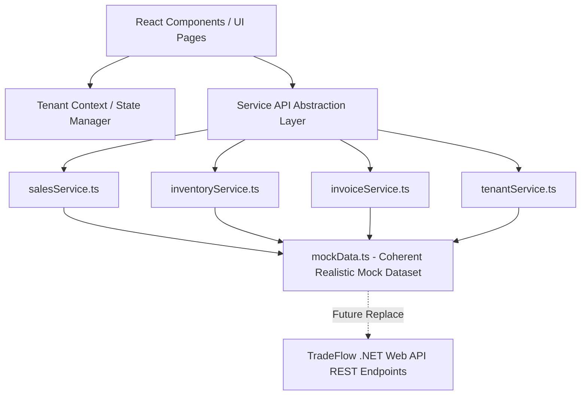

# Implementation Plan - TradeFlow Modern SaaS ERP Frontend

Building an ultra-modern, professional, clean, and responsive SaaS ERP Dashboard frontend for **TradeFlow** using **React (Vite)**, **Tailwind CSS**, and **Lucide Icons**.

## User Review Required

> [!IMPORTANT]
> The frontend application will be created in `src/TradeFlow.Web` inside the workspace root, seamlessly integrating with the existing TradeFlow repository structure.
> All mock data will be decoupled into dedicated service modules (`salesService.ts`, `inventoryService.ts`, `invoiceService.ts`, `tenantService.ts`) with async signatures, ensuring the UI is 100% API-ready for backend integration.

## Architecture & Service Layer Design

## Key Modules & Features

### 1. Multi-Tenant & Layout Navigation
- **Company Switcher**: Top bar dropdown selector to switch between active tenant organizations (e.g. *Apex Logistics Ltd*, *Global Distro Inc*, *Nordic Trade Corp*) with tenant-specific metrics and badges.
- **Top Header**: Global search, notifications popover with real-time inventory & invoice alerts, dark/light mode toggle, user profile avatar.
- **Sidebar Navigation**: Sleek, collapsible navigation with active state indicators for Overview, Sales Orders, Inventory & Warehouses, Invoices, and Customers.

### 2. Dashboard / Overview Page
- **KPI Cards**: Total Sales ($1,284,900, +14.2%), Active Orders (142), Low Stock Alerts (5 items), Pending Invoices ($89,400).
- **Interactive Visual Charts**: Dynamic Revenue & Order trends chart with timeframe toggles (7D, 30D, 90D, 1Y).
- **Recent Activity & Orders**: Fast summary tables and quick action triggers.

### 3. Sales Orders Management Page
- **Orders Data Table**: Filter by status (`Draft`, `Confirmed`, `Completed`, `Cancelled`), search by order # or customer.
- **Create Order Modal/Drawer**: Multi-step or drawer form to choose customer, source warehouse, dynamic item picker with live line-item pricing, tax rate calculation, and instant state save.

### 4. Inventory & Warehouse Management Page
- **Warehouse Filter & Stock Metrics**: Switch between overall stock or specific warehouses (*Chicago Central Hub*, *West Coast Logistics*, *Berlin Distro Center*).
- **Product Catalog Grid/Table**: Detailed view with SKUs, categories, current stock, reserved stock, safety thresholds, and low-stock warning badges.
- **Stock Adjustment Modal**: Quick restock and inventory audit log modal.

### 5. Invoices & Billing Module
- **Invoice List**: Due dates, payment status (`Paid`, `Unpaid`, `Partially Paid`, `Overdue`), invoice amounts, customer info.
- **Invoice View / Payment Drawer**: Clean Linear/Stripe-style invoice modal with print/download preview and mark-as-paid action.

---

## Proposed File Changes

### [NEW] `src/TradeFlow.Web`
- `package.json`: Dependencies (`react`, `react-dom`, `lucide-react`, `recharts`, `clsx`, `tailwind-merge`).
- `vite.config.ts`: Vite build configuration.
- `tailwind.config.js`: Customized design tokens (Slate, Indigo, Emerald, Amber, Rose color palettes, dark mode).
- `src/index.css`: Tailwind directives, glassmorphism utilities, scrollbar styling, fonts.
- `src/types/index.ts`: TypeScript interfaces for Tenant, Order, Product, Warehouse, Invoice, Customer.
- `src/services/mockData.ts`: Realistically linked dataset (products, SKUs, customers, orders, invoices).
- `src/services/api.ts`: Centralized service exports with mock API delays (`Promise`).
- `src/context/TenantContext.tsx`: React Context for tenant switching and reactive state store.
- `src/components/layout/Header.tsx`: Top bar with tenant switcher, search, notifications, theme toggle.
- `src/components/layout/Sidebar.tsx`: Modern collapsible navigation bar.
- `src/components/dashboard/OverviewPage.tsx`: KPI cards, visual charts, top selling products.
- `src/components/orders/OrdersPage.tsx`: Data table, search, filter, order drawer.
- `src/components/orders/CreateOrderModal.tsx`: Order creation modal.
- `src/components/inventory/InventoryPage.tsx`: Stock grid/table, warehouse filters, restock modal.
- `src/components/invoices/InvoicesPage.tsx`: Invoice list, filter by status, detail drawer.
- `src/components/invoices/InvoiceDetailModal.tsx`: Invoice preview modal.

---

## Verification Plan

### Automated Verification
- Verify Vite project creation and build output (`npm run build`).
- Verify TypeScript compilation without errors (`npm run build` or `npx tsc`).

### Manual & Interactive Verification
- Launch the Vite development server (`npm run dev`).
- Test all page views: Overview, Sales Orders, Inventory, Invoices.
- Test tenant switching from header dropdown and observe metric updating.
- Test creating a new sales order with multiple items and verify total calculation and immediate addition to table and KPIs.
- Test filtering inventory by warehouse and performing stock adjustments.
- Test dark/light mode toggle and responsive mobile drawer view.
